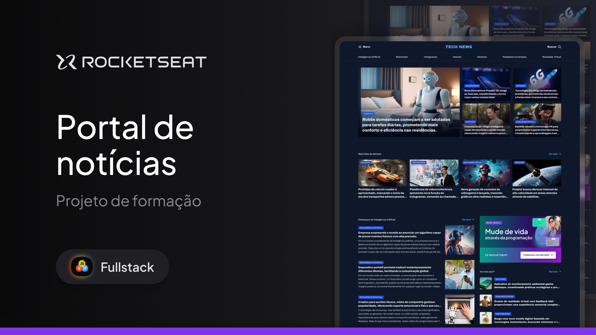

<h1 align="center">📰 Tech News | Portal de Notícias</h1>

<p align="center">
  Projeto desenvolvido durante o curso de <strong>Full-Stack da Rocketseat</strong>, utilizando <strong>HTML</strong>, <strong>CSS</strong> e conceitos de <strong>Grid Layout</strong>.
</p>

<p align="center">
  
</p>

<hr>

## 🎨 Projeto no Figma

Você pode visualizar o layout original do projeto no Figma clicando no link abaixo:

👉 [Acessar o Projeto no Figma](https://www.figma.com/community/file/1362166020452569562/portal-de-noticias)

---

## 🛠️ Tecnologias Utilizadas

- HTML5
- CSS3
- CSS Grid Layout

---

## 💡 Aprendizados

Neste projeto, aprimorei minhas habilidades em responsividade e aprendi a aplicar o **CSS Grid Layout** de forma eficaz para construir layouts adaptáveis.

---

## 🚀 Como Executar

1. Clone o repositório:
   ```bash
   git clone https://github.com/felipekenjii/projeto-portal-de-noticias.git
